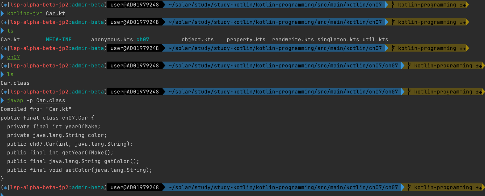

[TOC]

# 4장. 클래스와 객체 다루기

## 4.1 클래스 정의하기

* 클래스 정의는 커스텀으로 정의된 연산들이 포함된 새로운 타입을 만들어준다. 

* 기본적으로 클래스 선언은 **참조 타입**(referential type)을 정의한다. 즉, 이런 참조 타입의 값은 특정 클래스 인스턴스의 실제 데이터 위치를 가리키는 참조다. 
* 코틀린 1.3부터는 **인라인 클래스**(inline class)라는 개념이 도입됐다. 인라인 클래스를 사용하면 **참조 타입이 아닌 타입을 정의**할 수 있다. 

### 4.1.1 클래스 내부 구조

* class 키워드 다음에 클래스 이름이 오고 그다음에 클래스 본문이 오는 형태로 정의

  ```kotlin
  class Person {
      var firstName: String = ""
      var familyName: String = ""
      var age: Int = 0
  
      fun fullName() = "$firstName $familyName"
  
      fun showMe() {
          println("${fullName()}: $age")
      }
  }
  ```

위 코드는 모든 Person 클래스의 인스턴스마다 firstName, familyName, age라는 프로퍼티와 fullName() 및 showMe()라는 두 함수가 들어있게 된다.

* 여러 가지 프로퍼티 유형 중 가장 단순한 것은 그냥 **특정 클래스와 연관된 변수**다. 자바 클래스 필드와 비슷하게 생각될 수도 있으며, 더 일반적인 경우에는 **프로퍼티에 어떤 계산이 포함될 수 있다.**

  이럴 경우에는 클래스 인스턴스 내부에 저장되는 대신 그때그때 계산되거나 지연 계산되거나 맵(map)에서 값을 얻어오는 등의 방식으로 프로퍼티의 값을 제공할 수 있다.

* 모든 프로퍼티에서 일반적으로 쓸 수 있는 기능에는 다음과 같이 마치 변수처럼 프로퍼티를 사용하는 참조 구문이 있다.

  ```kotlin
  fun showAge(p: Person) = println(p.age) //프로퍼티 읽기
  fun readAge(p: Person) {
      p.age = readLine()!!.toInt() //프로퍼티에 쓰기
  }
  ```

* 프로퍼티는 어떤 클래스의 **구체적인 인스턴스**(위 코드에서 p가 이런 인스턴스)와 엮여 있기 때문에 이 인스턴스를 식으로 지정해야 한다. 이런 인스턴스를 **수신 객체(receiver)** 라 부르고, 수신 객체는 프로퍼티에 접근할 때 사용해야 하는 객체를 지정한다. 
* 멤버 함수의 경우에도 똑같이 수신 객체가 있고, 이런 경우 멤버 함수를 **메서드(method)** 라 부른다.

* 클래스 내부에서는 `this` 식으로 수신 객체를 참조할 수 있다. 

  대부분의 경우 this를 디폴트로 가정하기 때문에 수신 객체의 멤버 안에서 수신 객체의 멤버를 참조할 때는 this를 생략해도 된다. 

  ```kotlin
  class Person {
      var firstName: String = ""
      var familyName: String = ""
      var age: Int = 0

      fun fullName() = "${this.firstName} ${this.familyName}" //this 생략가능

      fun showMe() {
          println("${this.fullName()}: ${this.age}")
      }

  }
  ```

* this가 꼭 필요한 경우도 있다.

  예를 들어 어떤 클래스의 프로퍼티와 메서드 파라미터 이름이 같은 경우, 이 둘을 구분하기 위해 프로퍼티 이름 앞에 this를 써야 한다.

  ```kotlin
  class Person {
      var firstName: String = ""
      var familyName: String = ""

      fun setName(firstName: String, familyName: String) {
          this.firstName = firstName //프로퍼티에 this를 붙여서 파라미터와 구분
          this.familyName = familyName
      }
  }
  ```

* 인스턴스 생성 시 new 키워드가 필요없다. 함수를 사용하듯 그냥 클래스 이름을 이용한다.

  ```kotlin
  val person = Person()
  ```

* 기본적으로 코틀린 클래스는 공개(`public`) 가시성이다. 코드의 어느 부분에서나 클래스를 사용할 수 있다.
* 최상위 함수와 마찬가지로 최상위 클래스를 `internal`이나 `private`으로 설정할 수 있다. 이렇게 지정하면 클래스의 가시성 범위를 클래스 정의가 들어있는 파일 내부나 컴파일 모듈 내부로 제한할 수 있다.

* 코틀린에서는 소스 파일의 이름을 그 안에 들어있는 공개 클래스 이름과 똑같이 만들 필요가 없다. 한 파일 안에 여러 공개 클래스를 넣을 수도 있다.
* 클래스 프로퍼티는 지역 변수와 마찬가지로 불변일 수 있다. 하지만 이런 경우 초기화를 하는 동안 프로퍼티의 값을 지정할 수단이 있어야 한다. 그렇지 않다면 모든 클래스가 같은 프로퍼티 값을 사용하게 된다. 커스텀 생성자를 사용하여 해결할 수 있다.

  ```kotlin
  class Person {
    // 생성자로 초기화할 방법이 없으면 모든 클래스가 
    // firstName에 대해 같은 값을 사용하게 됨
    val firstName = "John"
  }
  ```


#### 들여다보기 - 필드와 프로퍼티 (cf. 다재다능 코틀린 프로그래밍 책)

자바 필드와 달리, 코틀린에서는 클라이언트 코드를 바꾸지 않아도 **원하는 대로 프로퍼티의 구현을 바꿀 수 있기 때문에**(예를 들어 커스텀 게터나 세터를 추가해도 클라이언트 소스코드를 바꿀 필요가 없다) **코틀린 프로퍼티는 캡슐화(encapsulation)에 위배되지 않는다.** 즉, firstName이라는 **참조는 프로퍼티가 구현되는 방법과 무관하게 항상 올바른 참조로 남을 수 있다.** 프로퍼티가 사용하는 내부 필드는 항상 캡슐화돼 있고 클래스 정의 밖에서는 이 내부 필드에 접근할 수 없다. 사실은 프로퍼티 정의 자체가 아니면 이런 내부 필드에 접근할 방법이 없다.


```kotlin
// Car.kt
class Car(val yearOfMake: Int, var color: String)
```

* 위 예제의 `yearOfMake`, `color` 은 (Java의 관점에서 봤을 때 속성이라기보다는 필드에 가깝다. 하지만) **모두 필드가 아니고 속성(프로퍼티)이다. 코틀린에서는 클래스에 필드가 없다.**

- 코틀린에선 getter, setter 대신 속성의 이름을 이용해서 속성에 접근할 수 있다.
- `car.yearOfMake` 를 호출하면 실제로는 `car.getYearOfMake()`를 호출한 것이다. (자바에서 처럼 직접 필드에 접근할 수 없다.)

컴파일러는 JavaBean 컨벤션을 존중한다. 코틀린 컴파일러로 바이트코드를 생성하는 실험을 해보자

1. javap 툴을 이용해서 앞서 만든 Car.kt 코드를 컴파일하고 바이트코드를 살펴보자

   ```kotlin
   kotlinc-jvm Car.kt //Car.class 파일을 만들어준다. (package가 있다면 package 하위 경로에)
   javap -p Car.calss //class 파일 디셈블러
   ```

   > `javap` 커맨드 : 자바 클래스 파일 역어셈블러 어떤 바이트코드 파일이 어디서부터 나왔으며, 어떠한 필드와 메소드를 갖고 있는 파일인지를 알려주는 기능

   

2. 코틀린 컴파일러가 생성한 Car 클래스의 바이트코드이다.

   ```kotlin
   ~ javap -p Car.class
   Compiled from "Car.kt"
   public final class ch07.Car {
     private final int yearOfMake; //백킹필드
     private java.lang.String color; //백킹필드 - private으로 자바에서 필드에 직접 접근할 수 없다.
     public ch07.Car(int, java.lang.String); //생성자
     public final int getYearOfMake(); //getter
     public final java.lang.String getColor(); //getter
     public final void setColor(java.lang.String); //setter
   }
   ```

   Car 클래스 한줄의 코드를 코틀린 코드가 속성을 위한 두 개의 백킹 필드(backing field), 생성자, 두 개의 getter, 하나의 setter로 바뀌었다.

* 자바는 필드가 없거나 필드 이름이 'aaa'여도 `getName()`, `setName()` 이라는 게터, 세터가 있으면,  `getName()`, `setName()` 가 **프로퍼티**가 된다. 이 때 사용되는 필드인 'aaa'가 백킹 필드라고 한다. 즉, **프로퍼티는 메서드를 가지고 정의가 된다.**

  → 앞서 "코틀린의 프로퍼티 참조는 프로퍼티가 구현되는 방법과 무관하게 항상 올바른 참조로 남을 수 있다."라는 문구에서 올바르지 않은 참조가 되는 경우가 이해되지 않았었는데 자바에서는 `getName()`, `setName()` 이라는 게터, 세터에서 'aaa'라는 백킹필드가 아닌 'bbb'라는 백킹필드를 사용하도록 수정해버리면 'aaa'에 대한 참조가 올바르지 않게되는 상황을 말하는 것으로 이해했다.

* 코틀린에서 백킹필드가 결국 자바에서 필드가 된다. (게터에서 사용되는 필드) → 코들린에서 `field` 라는 키워드로 필드에 접근할 수 있다.

> [Field vs Properties 차이](https://m.blog.naver.com/PostView.naver?isHttpsRedirect=true&blogId=saga111&logNo=120015999769)

> 필드와는 달리 프로퍼티는 get/set 접근자를 통해 멤버 변수에 접근하게 함으로써 클래스 내부의 데이터를 외부의 접근으로부터 보호할 수 있다는 겁죠.


### 4.1.2 생성자

* 생성자 - 클래스 인스턴스를 초기화해주고 인스턴스 생성 시 호출되는 특별한 함수

  ```kotlin
    class Person(firstName: String, familyName: String) {
      val fullName = "$firstName $familyName"
  }
  
  fun main() {
      val person = Person("승우", "조") // 새 Person 인스턴스 생성
      println(person.fullName) //승우 조
  }
  ```

class 키워드 이름 뒤에 덧붙인 파라미터 목록이 클래스의 인스턴스를 생성할 때 클래스에 전달된다. 이 파라미터를 사용해 프로퍼티를 초기화한다.

* 클래스 헤더의 파라미터 목록을 **주생성자(primary constructor) 선언**이라고 부른다. 

* 주생성자는 함수와 달리 본문이 하나가 아니다.

  대신 주생성자는 클래스 정의 내에서 **프로퍼티 초기화**와 **초기화 블록**이 등장하는 순서대로 구성된다. 

* **초기화 블록**이란 **`init`이라는 키워드가 앞에 붙은 블록**이다. 이 블록 안에서 클래스 초기화 시 필요한 간단하지 않은 초기화 로직을 수행할 수 있다.

  예를 들어 다음 클래스는 주생성자가 호출될 때마다 메시지를 표시한다.

  ```kotlin
  class Person(firstName: String, familyName: String) {
    val fullName = "$firstName $familyName"  //1. 프로퍼티 초기화
    
    init { //2. 초기화 블록
      println("Created new Person instance: $fullName")
    }
  }
  ```

* 클래스 안에 init 블록이 여럿 들어갈 수 있다. 이런 경우 각 블록은 프로퍼티 초기화와 함께 순서대로 실행된다.

  **초기화 블록에는 return 문이 들어가지 못한다**는 점에 유의하자.

  ```kotlin
  class Person(firstName: String, familyName: String) {
    val fullName = "$firstName $familyName"
    
    init {
      if (firstName.isEmpty() && familyName.isEmpty()) return // error - 리턴문이 있으면 안됨
      println("Created new Person instance: $fullName")
    }
  }
  ```

* 프로퍼티 값을 프로퍼티 정의 시 초기화하지 않고 `init`블록 안에서 복잡한 초기화 로직을 실행해서 프로퍼티를 초기화할 수 있다.

  ```kotlin
  class Person(fullName: String) {
      val firstName: String
      val familyName: String
      init {
          val names = fullName.split(" ")
          if (names.size != 2) {
              throw IllegalArgumentException("Invalid name: $fullName")
          }
          firstName = names[0] //초기화 블록으로 프로퍼티를 초기화
          familyName = names[1]
      }
  }
  
  fun main() {
      val person = Person("승우 조")
      println(person.firstName) //승우
  }
  ```


* 컴파일러는 모든 프로퍼티가 확실히 초기화되는지 확인한다. 

  컴파일러가 주생성자의 모든 실행 경로가 모든 멤버 프로퍼티를 초기화하거나 (일부 프로퍼티가 초기화되지 않는 경우) 예외를 발생시키는지 확인할 수 없다면 다음과 같은 오류가 발생한다.

  ```kotlin
  class Person(fullName: String) {
    // error: property must be initialized or be abstract
    val firstName: String
    val familyName: String
    init {
      val names = fullName.split(" ")
      if (names.size == 2) { //이 외의 경우의 수에 대한 초기화로직이 없어서 에러가 발생
        firstName = names[0]
        familyName = names[1]
      }
    }
  }
  ```

* **주생성자 파라미터를 프로퍼티 초기화나 init 블록 밖에서 사용할 수는 없다.** 

  예를 들어 멤버 함수 내부에서는 firstName을 사용할 수 없기 때문에 다음 코드는 잘못된 코드다.

  ```kotlin
  class Person(firstName: String, familyName: String) {
    val fullName = "$firstName $familyName"
    fun printFirstName() {
      println(firstName) // Error: 주생성자 파라미터 firstName을 여기서 사용할 수 없다.
    }
  }
  ```

  이에 대한 해법

  1. (방법1) 생성자 파라미터의 값을 저장할 멤버 프로퍼티를 정의한다.

     ```kotlin
     class Person(firstName: String, familyName: String) {
       val firstName = firstName // firstName은 생성자 파라미터를 가리킴
       val fullName = "$firstName $familyName"
       fun printFirstName() {
         println(firstName) // Ok: 여기서 firstName은 멤버 프로퍼티를 가리킴
       }
     }
     ```

  2. (방법2) 생성자 파라미터의 값을 멤버 프로퍼티로 만든다.

     생성자 파라미터 앞에 `val`이나 `var` 키워드를 덧붙이면, **자동으로 해당 생성자 파라미터로 초기화되는 (생성자 파라미터와 이름이 같은) 프로퍼티를 정의한다.** 이때 파라미터 이름을 프로퍼티 초기화나 init 블록 안에서 참조하면 생성자 파라미터를 가리키고, 다른 위치에서 참조하면 프로퍼티를 가리키게 된다.

     ```kotlin
     class Person(val firstName: String, familyName: String) {
       val fullName = "$firstName $familyName" // firstName은 생성자 파라미터를 가리킴
       
       fun printFirstName() {
         println(firstName) // firstName은 멤버 프로퍼티를 가리킴
       }
     }
     
     fun main() {
       val person = Person("승우", "조")
       println(person.firstName) // firstName은 프로퍼티를 가리킴
     }
     ```

* `val`/`var` 파라미터를 사용하면 단순하지 않은 멤버가 포함되지만 본문은 비어있는 클래스를 정의할 수 있다.

  이런 경우 코틀린에서는 본문을 아예 생략할 수 있다. 이런 코딩 스타일을 권장한다.

  ```kotlin
  class Person(val firstName: String, val familyName: String = "") {
  }
  ```

* 함수와 마찬가지로 **디폴트 값**과 **vararg**를 생성자 파라미터에 사용할 수 있다.

  ```kotlin
  class Person(val firstName: String, val familyName: String = "") { //디폴트값 지정
    fun fullName() = "$firstName $familyName"
  }
  
  class Room(vararg val persons: Person) { //vararg 사용하여 여러개를 받을 수 있다.
    fun showNames() {
      for (person in persons) println(person.fullName())
    }
  }
  
  fun main() {
    val room = Room(Person("Solar"), Person("Solar", "Kim"))
    room.showNames()
  }
  ```

### 부생성자

* 여러 생성자를 사용해 클래스 인스턴스를 서로 다른 방법으로 초기화하고 싶을 경우, **부생성자(secondary constructor)** 를 사용할 수 있다.

  * **`constructor` 키워드**를 사용
  * 부생성자에 반환 타입을 지정할 수는 없지만, 기본적으로 부생성자는 Unit 타입 값을 반환하는 함수와 마찬가지 형태다. 
  * 특히 (init 블록과 달리) **부생성자 안에서는 return을 사용할 수 있다.**

  ```kotlin
  class Person {
    val firstName: String
    val familyName: String
    
    constructor(firstName: String, familyName: String) { //부생성자1
      this.firstName = firstName
      this.familyName = familyName
    }
    
    constructor(fullName: String) { //부생성자2
      val names = fullName.split(" ")
      if (names.size != 2) {
        throw IllegalArgumentException("Invalid name: $fullName")
      }
      firstName = names[0]
      familyName = names[1]
    }
  }

* 클래스에 주생성자를 선언하지 않은 경우

  1. **모든 부생성자는 자신의 본문을 실행하기 전에 프로퍼티 초기화와 init 블록을 실행한다.** 

     **이렇게 하면 어떤 부생성자를 호출하든지 공통적인 초기화 코드가 정확히 한 번만 실행되게 보장할 수 있다.**

  2. 부생성자가 **생성자 위임 호출**을 사용해 다른 부생성자를 호출하는 방법도 있다.

     생성자 파라미터 목록 뒤에 **콜론(`:`)** 을 넣고 그 뒤에 일반 함수를 호출하는 것처럼 코드를 작성하되, 함수 이름 대신 **this**를 사용하면 생성자 위임 호출이 된다.

     ```kotlin
     class Person {
       val fullName: String
       constructor(firstName: String, familyName: String):
         this("$firstName $familyName") //생성자 위임 호출
       constructor(fullName: String) {
         this.fullName = fullName
       }
     }
     ```

* 클래스에 주생성자가 있는 경우

  * (부생성자가 있는 경우) **모든 부생성자는 주생성자에게 위임을 하거나 다른 부생성자에게 위임을 해야 한다.** 

    예를 들어 앞의 예제에서 두 번째 생성자를 주생성자로 바꿀 수 있다.

    ```kotlin
    class Person(val fullName: String) {
      constructor(firstName: String, familyName: String):
        this("$firstName $familyName") //주생성자에게 위임
    }
    ```

* **부생성자의 파라미터 목록에는 val/var 키워드를 쓸 수 없다.**

  ```kotlin
  class Person {
    // error: 'val' on secondary constructor parameter is not allowed 
    constructor(val fullName: String) 
  }
  ```

> 부생성자와 클래스 상속이 결합되는 경우, 상위 클래스 생성자를 호출하는 것과 관련된 다른 문제가 있다. 이에 대해서는 **8장 클래스 계층 이해하기**에서 살펴본다.


### 4.1.3 멤버 가시성

* 가시성은 클래스 멤버마다 다르게 지정할 수 있다.

* **public(공개)** : 멤버를 어디서나 볼 수 있다. 디폴트 가시성이 바로 public이다. 따라서 명시적으로 public을 표기할 필요가 없다.
* **internal(모듈 내부)** : 멤버를 멤버가 속한 클래스가 포함된 컴파일 모듈 내부에서만 볼 수 있다.
* **protected(보호)** : 멤버를 멤버가 속한 클래스와 멤버가 속한 클래스의 모든 하위 클래스 안에서 볼 수 있다.
* **private(비공개)** : 멤버를 멤버가 속한 클래스 내부에서만 볼 수 있다.

> 코틀린과 달리, 자바의 기본 가시성은 **패키지 전용(package private)** 으로, 어떤 멤버를 이 멤버가 속한 클래스가 들어있는 패키지 내부로 제한된다. 자바에서 (어떤 정의를 어느 곳에서나 쓸 수 있게) 클래스 멤버를 공개 멤버로 정의하려면 명시적으로 **public 변경자를 정의 앞에 붙여야 한다.** 코틀린에는 자바의 패키지 전용에 해당하는 가시성이 없다

* 함수와 프로퍼티, 주생성자, 부생성자에 대해 가시성 변경자를 지원한다. 

  함수와 프로퍼티, 주생성자/부생성자는 모두 클래스 본문에 정의되거나 주생성자 파라미터로 정의된다. 

* 주생성자의 가시성을 지정하려면 constructor 키워드를 꼭 명시해야 한다.

  ```kotlin
  class Empty private constructor() { //주생성자를 private으로 설정
    fun showMe() = println("Empty")
  }
  
  fun main() {
    // error: cannot access '<init>': it is private in 'Empty'
    Empty().showMe() //Empty의 주생성자를 찾을 수 없다.
  }
  ```

  Empty 클래스의 유일한 생성자가 private이므로 이 클래스를 클래스 본문 외부에서 인스턴스화 할 수 없다. 

동반 객체(companion object)에서 팩토리 메서드(factory method)를 제공할 때 생성자를 감추는 방법을 어떻게 함께 조합할지 알아보자.


### 4.1.4 내포된 클래스(nested class)

* 코틀린 클래스는 다른 클래스도 멤버로 가질 수 있다. 이런 클래스를 내포된 클래스(nested class)라고 부른다. 

```kotlin
class Person (val id: Id, val age: Int) {
    class Id(val firstName: String, val familyName: String) //내포된 클래스
    fun showMe() = println("${id.firstName} ${id.familyName}, $age")
}

fun main() {
    val id = Person6.Id("Solar", "Kim")
    val person = Person(id, 25)
    person.showMe() //Solar Kim, 25
}
```

* 내포된 클래스를 둘러싸고 있는 클래스의 본문 밖에서는 Person.Id처럼 **내포된 클래스 이름 앞에 바깥쪽 클래스의 이름을 덧붙여야만 내포된 클래스를 참조할 수 있다.**

* 내포된 클래스에도 여러 가지 가시성을 지정할 수 있다.

  내포된 클래스도 자신을 둘러싼 클래스의 멤버이므로 자신을 포함하는 클래스의 비공개 선언에 접근할 수 있다.

```kotlin
class Person (private val id: Id, private val age: Int) {
  class Id(private val firstName: String,
           private val familyName: String) {
    fun nameSake(person: Person) = person.id.firstName == firstName
  }

  fun showMe() = println("${id.firstName} ${id.familyName}, $age") // error: cannot access 'familyName': it is private in 'Id'
}
```

* 자바와 달리, **바깥쪽 클래스는 자신에게 내포된 클래스의 비공개 멤버에 접근할 수 없다.**

* **내포된 클래스에 `inner`를 붙이면 자신을 둘러싼 외부 클래스의 현재 인스턴스에 접근할 수 있다.** → 내부 클래스가 된다.

```kotlin
class Person(val firstName: String, val familyName: String) {
  inner class Possession(val description: String) { //inner 키워드 -> 내부 클래스로 만든다.
    fun showOwner() = println(fullName())
  }
  
  val myChocolate = Possession("Dark Chocolate") //this.Possession("Dark Chocolate")와 동일
  private fun fullName() = "$firstName $familyName"
}

fun main() {
  val person = Person("Solar", "Kim")
  val wallet = person.Possession("Wallet") // Possession 생성자 호출. 외부 클래스 인스턴스(person)를 지정해야한다.
  wallet.showOwner() // Solar Kim
  println(person7.myChocolate.description) //Dark Chocolate
}
```

* **내부(inner)클래스 생성자를 호출할 때 외부 클래스 인스턴스를 지정해야 한다.**

* 내부 클래스를 가리킬 때도 this를 생략할 수 있다.

* 일반적으로 `this`는 항상 **가장 내부의 클래스 인스턴스**를 가리킨다. 따라서 내부 클래스 본문에서 this는 내부 클래스 자신을 가리킨다. 내부 클래스 본문에서 **외부 클래스 인스턴스를 가리켜야 한다면 한정시킨(qualified) this 식을 사용해야 한다.**

  * 한정시킨 `this` 식에서 `@` 기호 다음에 오는 식별자는 외부 클래스의 이름이다.

  ```kotlin
  class Person(val firstName: String, val familyName: String) {
    inner class Possession(val description: String) {
      fun getOwner() = this@Person //한정시킨 this@외부클래스명
    }
  }
  
  fun main() {
      val person = Person("쟈니", "서")
      val wallet = person.Possession("Wallet")
      println(wallet.getOwner().firstName) // 쟈니
  }
  ```


#### 내부(inner) 클래스 vs 중첩(nested) 클래스

내포된 클래스와 달리 **내부 클래스에는 반드시 자신과 연관된 외부 클래스 인스턴스가 있어야 한다.** 내부 클래스가 외부 클래스의 멤버에 접근할 수 있는 이유는 항상 자신과 연관된 외부 클래스 인스턴스가 있기 때문이다. 이를 내부 클래스 안에 컴파일러가 자동으로 정의해주는 외부 클래스 인스턴스를 가리키는 outer 같은 프로퍼티가 있는 것처럼 생각할 수 있다.

```kotlin
// nested class 중첩 클래스
class Outer {
    private val bar: Int = 1
    class Nested {
        fun foo() = 2
    }
}

val demo = Outer.Nested().foo() // == 2 (외부클래스를 참조하지 않음)
```

```kotlin
// inner class 내부 클래스
class Outer {
    private val bar: Int = 1
    inner class Inner {
        fun foo() = bar
    }
}

val demo = Outer().Inner().foo() // == 1 외부클래스를 항상 참조
```

|        | 내부(inner) 클래스  | 중첩(nested) 클래스  |
| ------ | ------------------- | -------------------- |
| 코틀린 | inner 키워드로 선언 | 기본                 |
| 자바   | 기본                | static 키워드로 선언 |


### 4.1.5 지역 클래스

* 함수 본문에서 클래스를 정의할 수 있다. 지역 클래스는 자신을 둘러싼 코드 블록 안에서만 쓰일 수 있다.

```kotlin
fun main() {
  class Point(val x: Int, val y: Int) {
    fun shift(dx: Int, dy: Int): Point = Point(x + dx, y + dy)
    override fun toString() = "($x, $y)"
  }
  val p = Point(10, 10)
  println(p.shift(-1, 3)) // (9, 13)
}

fun foo() {
  println(Point(0, 0)) // error. Point는 main함수 안에서만 쓰일 수 있다.
}
```

* 코틀린 지역 클래스도 자신을 둘러싼 코드의 선언에 접근할 수 있다. 특히 지역 클래스는 클래스 본문 안에서 자신이 접근할 수 있는 값을 포획(capture)할 수 있고, 심지어는 변경할 수도 있다.

```kotlin
fun main() {
  var x = 1
  
  class Counter {
    fun increment() {
      x++
    }
  }
  
  Counter().increment()
  
  println(x) // 2
}
```

> 코틀린과 달리 자바에서는 포획한 변수의 값을 변경할 수 없다. 더 나아가 익명 클래스 내부에서 포획한 변수를 사용할 경우에는 명시적으로 final로 선언해야만 한다. 하지만 코틀린이 제공하는 포획 변수를 변경하는 기능은 그에 따른 비용을 수반한다. 익명 객체와 이 객체를 둘러싸고 있는 코드 사이에 변수를 공유하기 위해 코틀린 컴파일러는 (공유되는) 값을 특별한 래퍼(wrapper) 객체로 둘러싼다. 위 Counter 예제를 컴파일한 바이트코드에 해당하는 자바 코드는 다음과 같다.

```java
import kotlin.jvm.internal.Ref.IntRef;

class MainKt {
  public static void main(String[] args) {
    final IntRef x = new IntRef(); // 래퍼 생성
    x.element = 1;
    
    final class Counter {
      public final void increment() {
        x.element++; // 공유된 데이터 변경하기
      }
    }
    
    (new Counter()).increment();
    
    System.out.println(x.element); // 공유된 데이터 읽기
  }
}
```

> 불변 변수는 값이 바뀌지 않기 때문에 래퍼가 필요 없으므로 이런 부가 비용이 없다.

* 가시성 변경자를 붙일 수 없다. 
* 함수, 프로퍼티, 생성자, 내포된 클래스 등 다른 클래스가 포함할 수 있는 모든 멤버를 포함할 수 있다. 하지만 내포된 클래스는 가시성 규칙을 혼동시키지 않기위해 반드시 inner 클래스여야만 한다.


## 4.2 널 가능성

### 4.2.1 널이 될 수 있는 타입

* 코틀린에서 기본적으로 모든 참조 타입은 **널이 될 수 없는 타입**이다.

  String 같은 타입에 null 값을 대입할 수 없다. null을 넘기면 컴파일 오류가 발생한다.

* 널이 될 수 없는 타입은 널에 대한 검사를 추가로 수행할 필요가 없고 파라미터를 역참조(dereference)할 때 NPE 발생을 걱정할 필요가 없다. 코틀린 컴파일러는 이런 오류를 컴파일 시점에 방지해준다.

* 타입 뒤에 물음표(`?`)를 붙이면 **널이 될 수 있는 타입**이 된다.

* 모든 널이 될 수 있는 타입은 원래 타입(?가 붙지 않은 타입)의 상위 타입이며, 원래 타입에 속하는 모든 값으로 이뤄진 집합을 null로 확장한 집합이 값의 집합이 된다. 따라서 널이 될 수 있는 타입의 변수에 항상 널이 될 수 없는 타입의 값을 대입할 수 있다.

* 런타임에 널이 될 수 없는 값은 실제로 널이 될 수 있는 값과 차이가 없다. 둘 사이 구분은 컴파일 수준에서만 존재한다. 코틀린 컴파일러는 널이 될 수 없는 값을 표현하기 위해 어떤 래퍼(예를 들어 자바 8의 Optional 클래스 같은)도 사용하지 않는다. 따라서 런타임에는 어떠한 부가 비용도 들지 않는다.

* Int나 Boolean 같은 원시 타입도 널이 될 수 있는 타입이 존재한다. 하지만 **원시 타입의 널이 될 수 있는 타입은 항상 박싱한 값만 표현한다.**

  ```kotlin
  fun main() {
    val n: Int = 1   // 원시 타입의 값
    val x: Int? = 1  // 박싱한 타입의 값을 참조
  }
  ```

* **Nothing? 타입**
  * 가장 작은 널이 될 수 있는 타입. 
  * null 값 자체의 타입
  * 널 상수 이외의 어떤 값도 포함하지 않는다. 
  * 다른 모든 널이 될 수 있는 타입의 하위 타입
* **Any? 타입**
  * 코틀린 타입 시스템 전체에서 가장 큰 타입
  * 널이 될 수 있는 모든 타입과 널이 될 수 없는 모든 타입의 상위 타입

* 널이 될 수 있는 타입은 원래 타입에 들어있는 어떤 프로퍼티나 메서드도 제공하지 않는다. 멤버 함수를 호출하거나 프로퍼티를 읽는 등의 일반적인 연산이 null에서는 의미가 없기 때문이다.

* 널이 될 수 있는 타입은 코틀린의 확장 메커니즘을 활용해 자체적인 메서드와 프로퍼티를 제공한다.

  ex) 문자열을 이어주는 연산(concatenation)

  ```kotlin
  fun exclaim(s: String?) {
    println(s + "!")
  }
  
  fun main() {
    exclaim(null) // null!
  }
  ```


### 4.2.2 널 가능성과 스마트 캐스트

* 코틀린의 스마트 캐스트(smart. cast) 기능

  nullable한 타입이 null에 대한 동등성 검사를 수행하면, 컴파일러는 코드 흐름에 따라 확실히 널이 아닌 부분을 알 수 있다. 그 후 컴파일러는 이 정보를 사용해 널이 될 수 있는 값을 널이 될 수 없는 값으로 타입 변환(cast)한다.

```kotlin
fun isLetterString(s: String?): Boolean {
  if (s == null) return false
  
  // s는 여기서 널이 될 수 없다
  // -> 변수 s를 널이 될 수 없는 String 타입으로 가정하고 나머지 함수 본문을 실행한다.
  if (s.isEmpty()) return false
  
  for (ch in s) {
    if (!ch.isLetter()) return false
  }
  
  return true
}
```

* when이나 루프 같은 조건 검사가 들어가는 다른 문이나 식 안에서도 스마트 캐스팅이 이루어진다.

```kotlin
fun describeNumber(n: Int?) = when (n) {
  null -> "null"
  // 아래에 있는 가지에서 n은 널이 될 수 없다
  in 0..10 -> "small"
  in 11..100 -> "large"
  else -> "out of range"
}
```

* `||`나 `&&` 연산의 오른쪽에서 스마트 캐스팅

```kotlin
fun isSingleChar(s: String?) = s != null && s.length == 1
```

* 널 검사와 사용 지점 사이에서 값이 변경되는 경우에는 스마트 캐스트가 작동하지 않는다.

```kotlin
var s = readLine() // String?
if (s != null) {
  s = readLine()
  // 변수 값이 바뀌므로 스마트 캐스트를 쓸 수 없음
  // error: only safe (?.) or non-null asserted (!!.) calls are allowed on a nullable receiver of type String?
  println(s.length)
}
```

* 언제든 코드의 다른 부분에서 값이 바뀔 수 있는 **객체의 가변 프로퍼티에 대해서는 절대 스마트 캐스트를 적용할 수 없다.**


### 4.2.3 널 아님 단언 연산자

* `!!` 연산자
* `KotlinNullPointerException` 예외(`NullPointerException`의 하위 클래스)를 발생시킬 수 있는 연산자이다.
* 이 연산자가 붙은 식의 타입은 원래 타입의 널이 될 수 없는 버전이다. 기본적으로 널 아님 단언은 자바 프로그램의 널 관련 동작, 즉 널 값을 역참조하려 할 때 예외를 던지는 동작을 부활시킨다. 

```kotlin
fun main() {
  var name: String? = null
  
  fun initialize() {
    name = "John"
  }
  
  fun sayHello() {
    println(name!!.uppercase())
  }
  
  initialize()
  sayHello()
}
```

* 일반적으로 널이 될 수 있는 값을 사용하려면 그냥 예외를 던지는 방식보다 더 타당한 응답을 제공해야 하기 때문에 정말 타당한 경우가 아니라면 이 연산자를 **사용하지 말아야 한다.**

  코드 제어 흐름을 고쳐 써서 컴파일러가 스마트 캐스트를 적용할 수 있게 하는 편이 더 낫다.


### 4.2.4 안전한 호출 연산자

* `?.` 연산자
* 안전한 호출 연산(safe call)을 사용하면 널이 될 수 없는 타입의 값에 있는 메서드를 사용할 수 있다.

```kotlin
fun readInt() = readLine()?.toInt()

// 위의 코드는 다음 함수와 같다.
fun readInt(): Int? {
  val tmp = readLine()
  
  return if (tmp != null) tmp.toInt() else null
}
```

* 수신 객체(왼쪽 피연산자)가 

  * 널이 아니면 →  일반적인 함수 호출처럼 작동한다. 

  * 널이면 → 안전한 호출 연산자는 호출을 수행하지 않고 그냥 널을 돌려준다. 

* 안전한 호출 연산자가 널을 반환할 수 있기 때문에 이런 연산이 반환하는 값의 타입은 상응하는 널을 고려하지 않는 연산자 반환 타입의 널이 될 수 있는 버전이 된다.

```kotlin
fun readInt() = readLine()?.toInt()

fun main() {
  val n = readInt() // Int? 타입이다.
  
  if (n != null) {
    println(n + 1)
  } else {
    println("No value")
  }
}
```


### 4.2.5 엘비스 연산자

* `?:` 연산자
* 널을 대신할 디폴트 값을 지정할 수 있다.
* 왼쪽 피연산자가 
  * 널이 아니면 → 왼쪽 피연산자의 값
  * 널이면 →  오른쪽 피연산자의 값

```kotlin
fun sayHello(name: String?) {
    println("Hello, " + (name ?: "Unknown"))
}

fun main() {
    sayHello("Johnny") // Hello, Johnny
    sayHello(null)   // Hello, Unknown
}
```

* return이나 throw 같은 제어 흐름을 깨는 코드를 엘비스 연산자 오른쪽에 넣으면 이에 상응하는 if 식을 대신할 수 있다.

```kotlin
class Name(val firstName: String, val familyName: String?)

class Singer(val name: Name?) {
    fun describe(): String {
        val currentName = name ?: return "Unknown"
        return "${currentName.firstName} ${currentName.familyName}"
    }
}

fun main() {
    println(Singer(Name("Johnny", "Seo")).describe()) // Johnny Seo
    println(Singer(null).describe()) // Unknown
}
```


## 4.3 단순한 변수 이상인 프로퍼티

코틀린 프로퍼티는 일반 변수를 넘어서, 프로퍼티 값을 읽거나 쓰는 법을 제어할 수 있는 훨씬 더 다양한 기능을 제공한다.

### 4.3.1 최상위 프로퍼티

* **최상위 수준에 프로퍼티**를 정의할 수도 있다. 이런 경우 프로퍼티는 **전역 변수**나 **상수**와 비슷한 역할을 한다.

* 최상위 가시성(public/internal/private)을 지정할 수 있다.
* 임포트 디렉티브에서 최상위 프로퍼티를 임포트할 수 있다.

```kotlin
// util.kt
package util

val prefix = "Hello, " // 최상위 불변 프로퍼티

----------------------------------------------
// main.kt
package main

import util.prefix //최상위 프로퍼티를 임포트

fun main() {
  val name = readLine() ?: return
  println("$prefix$name")
}
```


### 4.3.2 늦은 초기화

어떤 프로퍼티는 **클래스 인스턴스가 생성된 뒤 ~ 해당 프로퍼티가 사용되는 시점보다는 이전**에 초기화돼야 할 수도 있다. (예 - 단위 테스트를 준비하는 코드나 의존 관계 주입에 의해 대입돼야 하는 프로퍼티) 이런 경우 생성자에서는 초기화되지 않은 상태라는 사실을 의미하는 디폴트 값을 대입하고(예 - null) 실제 값을 필요할 때 대입할 수도 있다. 

```kotlin
import java.io.File

class Content {
  var text: String? = null
  
  fun loadFile(file: File) {
    text = file.readText() //늦은 초기화
  }
}

fun getContentSize(content: Content) = content.text?.length ?: 0 //null체크가 필수
```

항상 text 프로퍼티가 사용되기 전에 loadFile()호출로 초기화가 된다고 가정하면, 위 코드의 **단점**은 실제 값이 항상 사용 전에 초기화되므로 절대 널이 될 수 없는 값이라는 사실을 알고 있음에도 불구하고 **늘 널 가능성을 처리해야 한다**는 점이다. 

코틀린은 이런 패턴을 지원하는 **lateinit 키워드**를 제공한다.

```kotlin
import java.io.File

class Content {
  lateinit var text: String //lateinit 키워드 적용
  
  fun loadFile(file: File) {
    text = file.readText()
  }
}

fun getContentSize(content: Content) = content.text.length //불필요한 safe call을 없앤다.
```

lateinit 표시가 붙은 프로퍼티는 값을 읽으려고 시도할 때 프로그램이 프로퍼티가 초기화됐는지 검사해서 **초기화되지 않은 경우 `UninitializedPropertyAccessException`을 던진다**는 한 가지 차이를 제외하면 일반 프로퍼티와 같다. (암시적인 !! 연산자와 비슷)

* 프로퍼티를 lateinit으로 만들기 위해서는 몇 가지 조건을 만족해야 한다. 

  1. 프로퍼티가 코드에서 변경될 수 있는 지점이 여러 곳일 수 있으므로 **프로퍼티를 가변 프로퍼티(var)로 정의해야 한다.** 

  2. 프로퍼티의 타입은 **널이 아닌 타입이어야 하고** Int나 Boolean 같은 **원시 값을 표현하는 타입이 아니어야 한다.**

     내부에서 lateinit 프로퍼티는 초기화되지 않은 상태를 표현하기 위해 null을 사용하는 널이 될 수 있는 값으로 표현되기 때문

  3. lateinit 프로퍼티를 정의하면서 초기화 식을 지정해 값을 바로 대입할 수 없다. (이러면 lateinit 키워드가 필요없기 때문)

* 코틀린 1.2부터 lateinit과 관련한 몇 가지 개선 사항을 도입했다. 
  * 최상위 프로퍼티와 지역 변수에서 늦은 초기화를 사용할 수 있게 됐다.
  * lateinit 프로퍼티의 값을 읽기 전에 lateinit 프로퍼티가 설정됐는지를 알아보는 기능


### 4.3.3 커스텀 접근자 사용하기

* 코틀린 프로퍼티는 **커스텀 접근자(custom accessor)** 를 통해 **변수와 함수의 동작을 한 선언 안에 조합**할 수 있다.

* 커스텀 접근자 : 프로퍼티 값을 읽거나 쓸 때 호출되는 특별한 함수

* 프로퍼티 값을 읽을 때 사용하는 커스텀 게터(getter)를 정의하는 예제

  * 게터는 프로퍼티 정의 끝에 붙으며 기본적으로 이름 대신 **`get`이라는 키워드**가 붙은 함수처럼 보인다. 하지만 이런 **프로퍼티를 읽으면 프로그램이 자동으로 게터를 호출한다.**

  * 파라미터가 없다.

  * 반환 타입은 (만약 반환 타입을 지정한다면) 프로퍼티의 타입과 같아야 한다.

    ```kotlin
    class Person(val firstName: String, val familyName: String) {
      val fullName: String
        get(): String {
          return "$firstName $familyName"
        }
    }
    ```

  * 접근자에도 식이 본문인 형태를 사용할 수 있다.

    ```kotlin
    val fullName: String
      get() = "$firstName $familyName"
    ```
    
  * 코틀린 1.1부터는 프로퍼티와 게터 정의에서 프로퍼티의 타입을 생략하고 타입 추론에 의존할 수 있다.
  
    ```kotlin
    val fullName
      get() = "$firstName $familyName" // 타입이 String으로 추론된다
    ```
  
* 앞의 코드처럼 도입한 프로퍼티의 값은 매번 fullName 프로퍼티를 읽을 때마다 다시 계산된다.

* firstName, familyName과 달리 fullName에는 **뒷받침하는 필드(backing field)가 없기 때문에 클래스 인스턴스에서 전혀 메모리를 차지하지 않는다.** 

  즉, 기본적으로 fullName은 **프로퍼티 형태인 함수**와 같다. 

  자바에서는 이런 경우 보통 getFullName()으로 게터 이름을 정한다.

* 뒷받침하는 필드와 관련한 규칙은 다음과 같다. **프로퍼티에 명시적으로 field를 사용하는 디폴트 접근자나 커스텀 접근자가 하나라도 있으면 뒷받침하는 필드가 생성된다.** 불변 프로퍼티의 접근자는 읽기 접근자 하나뿐이므로 앞 예제에서 fullName은 직접 뒷받침하는 필드인 field를 참조하지 않는다는 사실을 쉽게 알 수 있다. 따라서 fullName 프로퍼티에는 뒷받침하는 필드가 없다.

* 직접 뒷받침하는 필드에 접근하는 것은 어떨까? 

  프로퍼티가 어떤 저장된 값을 사용하지만 **프로퍼티에 대한 접근을 커스텀화해야 할 경우, 뒷받침하는 필드에 접근할 수 있으면 유용하다.** 

  예를 들어 프로퍼티를 읽을 때마다 로그를 남기고 싶다면 다음과 같이 할 수 있다.

  ```kotlin
  class Person(val firstName: String, val familyName: String, age: Int) {
    val age: Int = age
      get(): Int {
        println("Accessing age")
        return field //field 키워드로 뒷받침하는 필드를 참조할 수 있다.
      }
  }
  ```

* 뒷받침하는 필드 참조는 **`field`라는 키워드**를 사용하며 **접근자의 본문 안에서만 유용**하다.

* **프로퍼티에 뒷받침하는 필드가 없다면 필드를 초기화할 수 없다.** 초기화는 기본적으로 클래스를 인스턴스화할 때 값을 뒷받침하는 필드에 직접 대입하는 것이기 때문이다. 그래서 앞 예제에서 본 (뒷받침하는 필드가 없이 게터만 있는) fullName을 초기화하지 않았다. 계산에 의해 값을 돌려주는 프로퍼티의 경우 뒷받침하는 필드가 필요하지 않다.

> 커스텀 게터가 있는 프로퍼티는 파라미터가 없는 함수처럼 동작한다. 
> **함수를 사용하는 경우** vs **프로퍼티를 사용하는 경우**를 어떻게 구분할까?
>
> 값을 계산하는 과정에서 **예외가 발생할 여지가 없거나, 값을 계산하는 비용이 충분히 싸거나, 값을 캐시해 두거나, 클래스 인스턴스의 상태가 바뀌기 전에는 여러 번 프로퍼티를 읽거나, 함수를 호출해도 항상 똑같은 결과를 내는 경우**에는 함수보다 **프로퍼티를 사용하는 쪽을 권장**한다.

* var로 정의하는 가변 프로퍼티에는 값을 설정하기 위한 세터(setter)라는 접근자가 있다.
  * 프로퍼티 세터의 파라미터는 **단 하나**이며, 타입은 **프로퍼티 자체의 타입과 같아야 한다.**
    파라미터 타입을 항상 미리 알 수 있기 때문에 세터에서는 파라미터 타입을 생략한다. 
  * 관습적으로 파라미터 이름을 value로 정하는 경우가 많다. (다른 이름도 가능)
  * **프로퍼티를 초기화하면 값을 바로 뒷받침하는 필드에 쓰기 때문에 프로퍼티 초기화는 세터를 호출하지 않는다.**

```kotlin
class Person(val firstName: String, val familyName: String) {
  var age: Int? = null
    set(value) {
      if (value != null && value <= 0) {
        throw IllegalArgumentException("Invalid age: $value")
      }
      field = value //뒷받침하는 필드에 쓰기 때문에 여기서 세터를 호출하지 않는다.
    }
}

fun main() {
  val person = Person("John", "Doe")
  person.age = 20     // 커스텀 세터를 호출
}
```

게터, 세터 접근자를 모두 커스텀화하고 두 접근자가 모두 다 field 키워드를 통해 뒷받침하는 필드를 사용하지 않는 경우를 제외하면 항상 뒷받침하는 필드가 생긴다. 예를 들어 앞의 age 프로퍼티는 디폴트 게터를 사용하고 세터에서 field를 직접 언급하기 때문에 뒷받침하는 필드를 생성한다. 반면 다음 프로퍼티는 그렇지 않기 때문에 뒷받침하는 필드가 생기지 않는다.

```kotlin
class Person(var firstName: String, var familyName: String) {

  var fullName: String
    get(): String = "$firstName $familyName" //커스텀 게터 -> field 사용하지 X
    set(value) { //커스텀 세터 -> field 사용하지 X
      val names = value.split(" ") // 공백으로 구분해 단어를 분리한다
      if (names.size != 2) {
        throw IllegalArgumentException("Invalid full name: '$value'")
      }
      firstName = names[0]
      familyName = names[1]
    }
}
```

* 프로퍼티 접근자에 가시성 변경자를 붙일 수도 있다. 

  프로퍼티가 포함된 클래스 외부에서는 프로퍼티의 값을 변경하지 못하게 해서 외부에서 볼 때는 실질적으로 객체가 불변인 것처럼 여겨지게 하고 싶을 때 이런 방식을 사용할 수 있다. 

* 단순한 접근자 구현(뒷받침하는 필드를 바로 돌려주는 게터와 뒷받침하는 필드에 값을 바로 대입하는 세터)만 필요한 경우에는 그냥 get이나 set 키워드만 사용해서 게터와 세터를 정의할 수 있다.

```kotlin
class Person(name: String) {
  var lastChanged: Date? = null
    private set // Person 클래스 밖에서는 변경할 수 없다
  
  var name: String = name
    set(value) {
      lastChanged = Date()
      field = value
    }
}
```

> JVM의 관점에서 볼 때 코틀린 프로퍼티는 일반적으로 비공개 프로퍼티에 의해 뒷받침되는 한두 개의 접근자나 메서드(getFullName()과 setFullName()처럼)에 대응된다. 이들 메서드 자체는 **코틀린 코드에서 호출할 수 없지만 자바 클래스에서는 이런 메서드를 호출할 수 있으며**, 이런 점이 **자바/코틀린 상호 운용성에서 가장 중요한 부분**이다. (12장 자바 상호 운용성)
>
> 비공개 프로퍼티는 자신이 포함된 클래스 밖에서 사용할 수 없기 때문에 기본적으로 아무 접근자 메서드도 생성되지 않는다. 이런 비공개 프로퍼티에 대한 접근은 직접 필드에 접근함으로써 최적화된다.

* lateinit 프로퍼티의 경우 항상 자동으로 접근자가 생성되기 때문에 프로그래머가 직접 커스텀 접근자를 정의할 수 없다. 
* 주생성자 파라미터로 선언된 프로퍼티에 대한 접근자도 지원하지 않는다. → 일반적인 프로퍼티가 아닌 생성자 파라미터를 사용하고 클래스 본문 안에서 프로퍼티에 그 값을 대입함으로써 해결 가능


### 4.3.4 지연 계산 프로퍼티와 위임

* 어떤 프로퍼티를 처음 읽을 때까지 그 값에 대한 계산을 미뤄두고 싶을 때 `lazy` 프로퍼티를 사용할 수 있다.
* lazy 다음에 오는 블록 안에는 프로퍼티를 초기화하는 코드를 지정한다. 

```kotlin
import java.io.File

val text by lazy { //text 프로퍼티를 lazy로 정의 //프로퍼티 타입 명시 가능
  File("data.txt").readText()
}

fun main() {
  while (true) {
    when (val command = readLine() ?: return) {
      "print data" -> println(text)
      "exit" -> return
    }
  }
}
```

 main() 함수에서 사용자가 적절한 명령으로 프로퍼티 값을 읽기 전까지, 프로그램은 lazy 프로퍼티의 값을 계산하지 않는다. 초기화가 된 이후 프로퍼티의 값은 필드에 저장되고, 그 이후로는 프로퍼티 값을 읽을 때마다 저장된 값을 읽게 된다.

* 간단한 초기화를 통해 다음과 같이 프로퍼티를 정의 →  프로그램이 시작될 때 바로 파일을 읽는다.

  ```kotlin
  val text = File("data.txt").readText()
  ```

* 게터를 사용한 프로퍼티를 사용 → 프로그램이 프로퍼티 값을 읽을 때마다 파일을 매번 다시 읽어온다.

  ```kotlin
  val text get() = File("data.txt").readText()
  ```

이 구문은 사실 프로퍼티 처리에 필요한 데이터를 모아 유지하면서 읽기와 쓰기를 처리하는 **위임 객체(delegate object)**를 통해 프로퍼티를 구현하게 해주는 **위임 프로퍼티(delegate property)**라는 기능의 특별한 경우다. 위임 객체는 **`by`라는 키워드 다음에 위치**하며, 코틀린이 정한 규약을 만족하는 객체를 반환할 수 있는 임의의 식이 될 수 있다. 우리 예제에서 `lazy {}`는 코틀린의 내장 구성 요소가 아니라 표준 라이브러리 함수에 람다를 넘기는 식일 뿐이다.

> 코틀린이 기본으로 제공하는 몇 가지 위임 객체가 있다. 이는 **장 컬렉션과 I/O 자세히 알아보기**와 **11장 도메인 특화 언어**에서 살펴본다.

*  lazy 프로퍼티는 불변 프로퍼티가 아니다. lazy 프로퍼티는 일단 초기화된 다음에는 변경되지 않는다.

  ```kotlin
  // error: type 'Lazy<String>' has no method 'setValue(Chapter4, KProperty<*>, String)' and thus it cannot serve as a delegate for var (read-write property)
  var text by lazy { "Hello" }
  ```

* 디폴트로 lazy 프로퍼티는 **스레드 안전(thread-safe)**하다. 즉, 다중 스레드 환경에서도 값을 한 스레드 안에서만 계산하기 때문에 lazy 프로퍼티에 접근하려는 모든 스레드는 궁극적으로 같은 값을 얻게 된다.

* 코틀린 1.1부터는 지역 변수에도 위임을 쓸 수 있게 됐다. 이 기능을 사용하면 함수 본문에서 **지연 변수**를 정의할 수 있다.

  ```kotlin
  fun longComputation(): Int {...}
  
  fun main(args: Array<String>) {
    val data by lazy { longComputation() } // lazy 지역 변수
    val name = args.firstOrNull() ?: return
    println("$name: $data") // name이 널이 아닐 때만 data에 접근할 수 있음
  }
  ```

* 위임 프로퍼티에 대해서는 스마트 캐스트를 사용할 수 없다.

  위임은 구현이 다 다를 수 있기 때문에 커스텀 접근자로 정의된 프로퍼티처럼 다뤄진다. 즉, 위임을 사용한 지역 변수의 경우에도 스마트 캐스트를 쓸 수 없다는 뜻이기도 하다.

  ```kotlin
  fun main() {
    val data by lazy { readLine() }
    
    if (data != null) {
      // error: smart cast to 'String' is impossible, because 'data' is a property that has open or custom getter
      println("Length: ${data.length}")
    }
  }


## 4.4 객체

### 4.4.1 객체 선언

* 객체 선언이 싱글턴을 표현한다.

* 싱글턴 선언 : `class` 대신 `object`라는 키워드를 사용

```kotlin
object Application {
  val name = "Solari App"
  
  override fun toString() = name
  
  fun exit() { }
}
```

이런 객체 선언은 클래스를 정의하는 동시에 클래스의 인스턴스를 정의하는 것이기도 하다. 

```kotlin
fun describe(app: Application) = app.name 
// Application은 타입이다.

fun main() {
  println(Application)  // Application은 값이다.
}
```

싱글턴 인스턴스는 단 하나뿐이므로 인스턴스만 가리켜도 어떤 타입을 쓰는지 충분히 알 수 있다. 따라서 객체를 타입으로 사용해도 무의미하다.

* 객체 정의는 **스레드 안전**하다.

  컴파일러는 실행되는 여러 스레드에서 싱글턴에 접근하더라도 오직 한 인스턴스만 공유되고 초기화 코드도 단 한 번만 실행되도록 보장한다.

* **초기화는 싱글턴 클래스가 실제 로딩되는 시점까지 지연된다.**

   보통은 프로그램이 객체 인스턴스에 처음 접근할 때 초기화가 이뤄진다.

 Application 객체의 JVM 바이트코드를 살펴보자

```java
public final class Application {
   @NotNull
   private static final String name;
   @NotNull
   public static final Application INSTANCE; //<- **

   @NotNull
   public final String getName() {
      return name;
   }

   @NotNull
   public String toString() {
      return name;
   }

   public final void exit() { }

   private Application() { }

   static {
      Application var0 = new Application();
      INSTANCE = var0;
      name = "Solari App";
   }
}
```

코틀린 코드에서는 INSTANCE 변수에 접근할 수 없다. 하지만 코틀린의 싱글턴을 참조하는 자바 클래스에서는 이 변수를 사용할 수 있다. **12장 자바 상호 운용성**에서 더 자세히 다룬다.

* 객체 선언도 멤버 함수와 프로퍼티를 포함할 수 있고, 초기화 블록도 포함할 수 있다.

* 하지만 객체에는 **주생성자나 부생성자가 없다.**

  객체 인스턴스는 항상 암시적으로 만들어지기 때문에 객체의 경우 생성자 호출이 아무런 의미가 없다.

* 객체의 본문에 들어있는 클래스에는 **`inner`가 붙을 수 없다.**

  객체 선언은 항상 인스턴스가 하나뿐이기 때문에 바깥쪽 클래스의 인스턴스와 연관되는 `inner`가 불필요하다.

* 최상위 선언들과 마찬가지로, 객체의 멤버를 임포트해서 간단한 이름만 사용해 참조할 수 있다. 

  ```kotlin
  import Application.exit
  
  fun main() {
    println(Application.name) // 전체 이름을 사용
    exit()                    // 간단한 이름을 사용
  }
  ```

  하지만 **객체의 모든 멤버가 필요할 때 임포트 문으로 임포트할 수는 없다.**

  ```kotlin
  import Application.* // Error
  ```

  이런 제약을 가하는 이유는 객체 정의 안에는 다른 클래스 정의와 같이 toString()이나 equals()와 같은 **공통 메서드 정의가 들어있기 때문**이다. 이로 인해 **필요시 임포트를 사용하면 이런 공통 메서드까지 임포트돼 문제가 생길 수 있다.**

* 클래스와 마찬가지로 객체도 다른 클래스 안에 내포될 수 있고, 심지어는 다른 객체 안에 내포될 수도 있다. 이렇게 내포된 객체 선언도 싱글턴이다.

* 하지만 객체를 함수 내부에 넣거나 지역 클래스 또는 내부 클래스 안에 넣을 수 없다. 이런 정의들은 어떤 외부 문맥에 의존하므로 싱글턴이 될 수 없기 때문이다.

  **객체 식(object expression)** 을 사용하면 지역 영역의 객체를 만들 수 있다. 

> 자바 세상에는 유틸리티 클래스(utility class)가 종종 존재한다.
>
> 이런 패턴은 코틀린에서는 일반적으로 권장되지 않는 패턴이다. 
>
> 코틀린은 자바와 달리 최상위 선언을 패키지 안에 함께 모아둘 수 있으므로 불필요하게 유틸리티 클래스를 선언해야 할 필요가 없다.


### 4.4.2 동반 객체

* 내포 객체도 인스턴스가 생기면 자신을 둘러싼 클래스의 비공개 멤버에 접근할 수 있다. 
* 이런 특성은 **팩토리 디자인 패턴**을 쉽게 구현하는 경우 유용하게 활용할 수 있다. 

```kotlin
class Application private constructor(val name: String) { //비공개 주 생성자
  object Factory { //내포된 객체 - 팩토리 메서드
    fun create(args: Array<String>): Application? {
      val name = args.firstOrNull() ?: return null
      return Application(name)
    }
  }
}

fun main(args: Array<String>) {
  // val app = Application(name) // 직접 생성자를 호출하도록 허용하지 않음
  val app = Application.Factory.create(args) ?: return //팩토리 메서드를 내포한 객체 이름(Factory)을 지정해야한다.
  println("Application started: ${app.name}")
}
```

* Factory 메서드를 **동반 객체(companion object)** 로 정의하면, 동반 객체의 멤버에 접근할 때는 동반 객체의 이름을 사용하지 않고 동반 객체가 들어있는 외부 클래스의 이름을 사용할 수 있다.
*  **동반 객체 : companion이라는 키워드를 덧붙인 내포된 객체**

```kotlin
class Application private constructor(val name: String) {
  companion object Factory { //동반 객체
    fun create(args: Array<String>): Application? {
      val name = args.firstOrNull() ?: return null
      return Application(name)
    }
  }
}

fun main(args: Array<String>) {
  val app = Application.create(args) ?: return // 동반 객체가 들어있는 외부 클래스의 이름(Application)을 사용해 간결하게 작성 가능
  println("Application started: ${app.name}")
}
```

* 동반 객체의 경우 정의에서 **이름을 생략**할 수도 있고, 이 경우 컴파일러는 동반 객체의 디폴트 이름을 Companion으로 가정한다.

  이런 방식을 더 권장한다.

  ```kotlin
  companion object { ... }
  ```

* 동반 객체의 멤버를 임포트하고 싶을 때는 **객체 이름을 명시해야만 한다.**

  ```kotlin
  import Application.Companion.create // OK
  import Application.create           // Error
  ```

* 클래스에 동반 객체가 둘 이상 있을 수는 없다.

* companion 변경자를 최상위 객체 앞에 붙이거나 다른 객체에 내포된 객체 앞에 붙이는 것은 금지된다. 

  최상위 객체의 경우 동반 객체를 연결할 클래스 정의가 없기 때문이고, 객체에 내포된 객체의 경우 companion을 붙이는 것이 불필요한 중복이기 때문이다.

* 동반 객체 안에서도 init 블록을 사용할 수 있다.

> 코틀린의 동반 객체를 자바의 정적 문맥과 대응하는 것처럼 생각할 수도 있다.
>
> 중요한 차이는 **코틀린 동반 객체의 문맥은 객체 인스턴스라는 점**이다. 이로 인해 자바의 정적 멤버(특히 정적 멤버 클래스)보다 코틀린 동반 객체가 더 유연하다. 코틀린 동반 객체는 다른 상위 타입을 상속할 수도 있고 일반 객체처럼 여기저기에 전달될 수 있기 때문이다.


### 4.4.3 객체 식

코틀린은 명시적인 선언 없이 객체를 바로 생성할 수 있는 특별한 식을 제공한다.  **객체 식(object expression)** 은 자바 **익명 클래스(anonymous class)** 와 아주 비슷하다.

```kotlin
fun main() {
  fun midPoint(xRange: IntRange, yRange: IntRange) = object { //객체 식 like 이름 없는 객체 정의
    val x = (xRange.first + xRange.last)/2
    val y = (yRange.first + yRange.last)/2
  }
  
  val midPoint = midPoint(1..5, 2..6)
  
  println("${midPoint.x}, ${midPoint.y}") // (3, 4)
}
```

* 객체 식이 만들어내는 값을 변수에 대입할 수 있다.

* 클래스나 객체 식과 달리 객체를 함수 안에 정의할 수는 없다.

  객체 선언이 싱글턴을 표현하지만 지역 객체들은 자신을 둘러싼 바깥 함수가 호출될 때마다 매번 다시 생성돼야 하기 때문이다.

  ```kotlin
  fun printMiddle(xRange: IntRange, yRange: IntRange) {
    // error: named object 'MidPoint' is a singleton and cannot be local. Try to use anonymous object instead
    object MidPoint {
      val x = (xRange.first + xRange.last)/2
      val y = (yRange.first + yRange.last)/2
    }
    
    println("${MidPoint.x}, ${MidPoint.y}")
  }
  ```

* midPoint() 함수가 반환하는 객체의 타입은 객체 식 안에 정의된 모든 멤버가 들어있는 클래스를 표현하는 **익명 객체 타입**(anonymous object type)이며, 이런 타입은 **단 하나만 존재**한다. (즉, 멤버가 모두 완전히 똑같은 두 객체 식이 있다고 해도, 둘의 타입은 서로 다르다!)

다음 예제는 객체 식의 타입이 익명 객체 타입이며, 지역 변수나 프로퍼티의 타입도 마찬가지일 수 있음을 보여준다.

```kotlin
fun main() {
  val o = object {  // 익명 객체 타입이 추론됨
    val x = readLine()!!.toInt()
    val y = readLine()!!.toInt()
  }
  println(o.x + o.y) // 여기서 o 안의 x와 y에 접근할 수 있음
} 
```

* 하지만 **익명 객체 타입은 지역 선언이나 비공개 선언에만 전달될 수 있다.** 

  예를 들어 midPoint 함수를 최상위 함수로 정의하면 객체 멤버에 접근할 때 컴파일 오류가 발생한다.

  ```kotlin
  fun midPoint(xRange: IntRange, yRange: IntRange) = object { //익명객체 타입이 아닌 객체 식에 지정된 상위 타입이 된다. => Any 타입
    val x = (xRange.first + xRange.last)/2
    val y = (yRange.first + yRange.last)/2
  }
  
  fun main() {
    val midPoint = midPoint(1..5, 2..6)
    // error: unresolved reference: x
    // error: unresolved reference: y
    println("${midPoint.x}, ${midPoint.y}") //Any 타입으로 추론돼서 참조를 찾을 수 없다.
  }
  ```

   midPoint() 함수의 타입은 객체 식에 해당하는 익명 객체 타입이 아니라 **객체 식에 지정된 상위 타입이 된다.** 하지만 예제 객체 식에는 상위 타입을 명시하지 않았기 때문에 Any를 상위 타입으로 가정한다. 그래서 midPoint.x 참조에서 x를 찾을 수 없는 것이다.

* 객체 식도 **자신을 둘러싼 코드 영역의 변수를 포획할 수 있다.** 

  이렇게 포획한 가변 변수를 객체 본문에서 **변경할 수 있다.** 컴파일러는 지역 클래스와 비슷하게 **데이터를 공유하기 위해 필요한 래퍼를 생성**해준다.

  > 언제 쓰임이 있는지 와닿지 않는다... 

  ```kotlin
  fun main() {
    var x = 1
    
    val o = object {
      fun change() {
        x = 2
      }
    }
    
    o.change()
    println(x) // 2
  }
  ```

* 지연 초기화되는 객체 선언과 달리 객체 식이 만들어내는 객체는 **객체 인스턴스가 생성된 직후 바로 초기화**된다.

  ```kotlin
  fun main() {
    var x = 1
    
    val o = object {
      val a = x++;
    }
  
    println("x = $x")       // x = 2
    println("o.a = ${o.a}") // o.a = 1
    println("x = $x")       // x = 2
  }
  ```

  o 정의에서 객체가 생성되는 시점에 이 객체의 a 프로퍼티가 초기화되므로 o.a에 접근하기 전에 x를 표시했음에도 불구하고 x의 값으로 2가 표시된다.

* 자바 익명 클래스와 달리 객체 식은 클래스 상속과 조합했을 때 더 강력해진다.
* 객체 식은 기존 클래스의 하위 클래스를 선언하지 않고도 기존 클래스를 약간만 변경해 기술하는 간결한 방법을 제공한다. => "8장 클래스 계층 이해하기"
